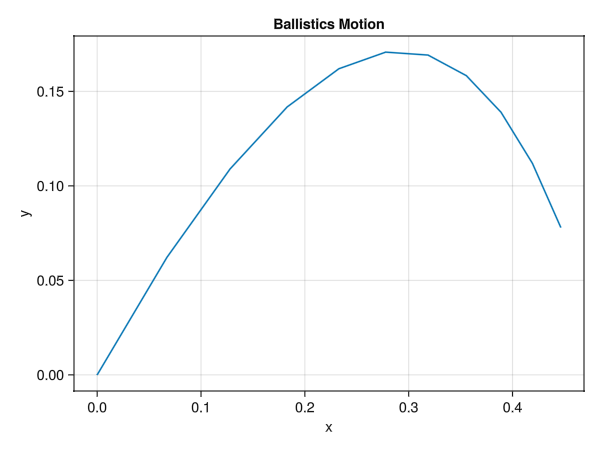
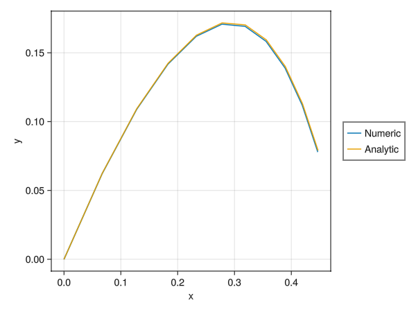

> 9. Canon ball. A cannon ball m is launched at angle θ and speed v0. It is acted on by gravity g and a viscous drag with magnitude |cv|.
>     (a) Find position vs time analytically.
>     (b) Find a numerical solution using θ = π/4, v0 = 1 m/s, g = 1 m/s 2 , m = 1 kg, c = 1 kg/ s.
>     (c) Compare the numeric and analytic solutions. At t = 2 how big is the error? How does the error depend on specified tolerances or step sizes?
>     (d) Use larger and larger values of v0 and for each trajectory choose a time interval so the canon at least gets back to the ground. Plot the trajectories (using equal scale for the x and y axis. Plot all curves on one plot. As v → ∞ what is the eventual shape? [Hint: the answer is simple and interesting.]
>     (e) For any given v0 there is a best launch angle θ ∗ for maximizing the range. As v0 → ∞ to what angle does θ ∗ tend? Justify your answer as best you can with careful numerics, analytical work, or both.

# a. Find position vs time analytically.

The corresponding code for this in file [./Ballistics/src/Ballistics.jl](./Ballistics/src/Ballistics.jl):

```julia
function analytical_sol(t)
    m, g, c = p.mass, p.gravity, p.viscosity

    u = zeros((4,))
    u[1] = vx0 * (-c/m) * (exp((-c/m)*(t-t0)) - 1)
    u[2] = ((vy0+(m*g/c))*(-c/m)*(exp((-c/m)*(t-t0)) - 1)) + ((-m*g/c)*(t-t0))
    u[3] = (vx0) * (exp((-c/m)*(t-t0)))
    u[4] = ((vy0) + (m*g/c)) * exp((-c/m)*(t-t0)) - (m*g/c)

    return u
end
```

This turned out to be wrong, it was an integral mistake (integration mistake). The corrected version in the same file:

```julia
function analytical_sol(t)
    m, g, c = p.mass, p.gravity, p.viscosity

    x = x0 + vx0 * ((-m / c) * exp((c / m) * (t0))) * (exp((-c / m) * t) - exp((-c / m) * t0))
    y = y0 + ((vy0 + (m * g / c)) * (-m / c) * (exp((c / m) * t0)) * (exp((-c / m) * t) - exp((-c / m) * t0))) + ((-m * g / c) * (t - t0))
    vx = (vx0) * (exp((-c / m) * (t - t0)))
    vy = ((vy0) + (m * g / c)) * exp((-c / m) * (t - t0)) - (m * g / c)

    u = zeros((4,))
    u[1] = x
    u[2] = y
    u[3] = vx
    u[4] = vy

    return u
end
```

TODO: Could I have created this analytical solution symbolically?

# b. Find a numerical solution using given parameters

The corresponding code for this in file [./Ballistics/src/Ballistics.jl](./Ballistics/src/Ballistics.jl):

```julia
using DifferentialEquations
#...
# problem setup
x0, y0 = 0.0, 0.0
r0 = [x0; y0]
speed0 = 1
launchangle = pi / 4
vx0, vy0 = speed0 * [cos(launchangle); sin(launchangle)]
v0 = [vx0; vy0]
u0 = [r0; v0]

t0 = 0.0
tend = 1.0
tspan = (t0, tend)
p = Parameters.Param(m=1, g=1, c=1)
prob = ODEProblem(Physics.ballistic!, u0, tspan, p)
#...
sol_numeric = solve(prob)
#...
Visualization.plot_trajectory(sol_numeric.u)
```

This numerical solution gives the following trajectory:



# c. Compare the numeric and analytics solutions? Plot time vs error. Plot step size and tolerances vs error.

For various initial conditions, the numeric and analytical solutions on the same graph, I was shifting the analytic in x direction by 0.1 unit to be able view both, otherwise they were overlapping with the default tolerances, but then I ended up using a non-dynamic step size explicit solver:

In file [./Ballistics/src/Ballistics.jl](./Ballistics/src/Ballistics.jl):


 


Now, I will plot the steps sizes vs error (euclidean norm of state vector at tend):


Now, I will change the relative tolerance and absolute tolerance.


# d. Use large and larger values of v0, plot all of their trajectory till ball hits ground. What happens to the eventual shape as v -> ∞ ?

# e. Plot speed verses best launch angle, numerically or analyticaly or both

This concludes my attempt of problem08.
