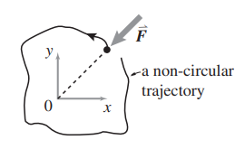
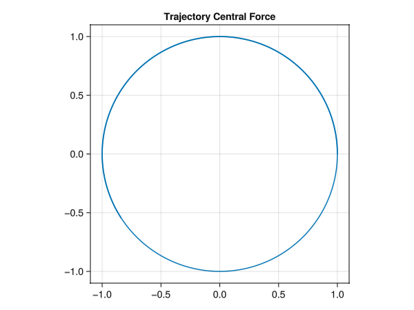

> 11\. **Central force.** These two problems are both about central forces. In both cases the only force is central (directed on the particle towards the origin) and only depends on radius: $\vec{\mathbf{F}} = −F(r)\mathbf{\hat{e}_r}$. The problems are independent, one does not follow from the other.
> 
> (a) Find a central force law $F(r)$ so that, comparing circular orbits of varying radii, the speed v is independent of radius.
> (b) By numerical experiments, and trial and error, try to find a periodic motion that is neither circular nor a straight line, for some central force besides $F = −kr$ or $F = \frac{−GmM}{r2}$ . a) not with a linear zero-rest length spring; b) not with inverse-square gravity; c) not circular motion; and d) not straight-line motion.
>     i. In your failed searches, before you find a periodic motion, do the motions always have regular patterns or are they sometimes chaotic looking (include some pretty pictures)?
>     ii. Puzzle: If you use a power law, what is the minimum number loops in one complete periodic orbit (a loop is, say, a relative maximum in the radius)? How does this depend on the exponent in the power law? You probably cannot make progress with this analytically, but you can figure it out with numerical experiments
> 
> \[Matlab hint: To do this properly you probably need to guess at a radial force law (most anything will work) and do numerical root finding (e.g., `FSOLVE`) to find initial conditions and the period of the orbit. Once you have your system you can define a function whose input is the initial conditions and the time of integration and whose output is the difference between the initial state and the final state. You can make this system ‘square’ by assuming that the particle is on the x axis in the initial state. You want to find that input which makes the output the zero vector. Pick a central force and search over initial conditions and durations. Do not use `FSOLVE` to search over force laws; do your orbit finding using a given force law\]
>
> 

# (a) Find a central force law $F(r)$ so that, comparing circular orbits of varying radii, the speed v is independent of radius.

Consider the relationship between centripetal force and velocity for uniform circular motion, since velocity is constant we can write:

$$F(r) = \frac{mv^2}{r}$$

$$F(r) = k\frac{m}{r}$$

Quickly drawing the trajectory for tangential initial conditions, in file [./CentralForce/src/CentralForce.jl](./CentralForce/src/CentralForce.jl):

```julia
u0 = [1.0;0.0;0.0;1.0]
tspan = (0.0,10.0)
m = 1.0
k = 1.0
p = Param(m, k)
ode = Physics.speedindependentofradius!
ode_prob = DifferentialEquations.ODEProblem(ode, u0, tspan, p)
sol = DifferentialEquations.solve(ode_prob)
```

This produces:



the trajectory for non-tangential inital velocity:

::: {.column-margin}
TODO: add graph for velocity vs radius
:::

# (b) By numerical experiments, and trial and error, try to find a periodic motion that is neither circular nor a straight line, for some central force besides $F = −kr$ or $F = \frac{−GmM}{r2}$ . a) not with a linear zero-rest length spring; b) not with inverse-square gravity; c) not circular motion; and d) not straight-line motion.

To do this in julia, I use the very nice notation of `NamedTuple`s (to skip unpacking):

```julia
function f((; u⃗₀, t), p)
    dynamics_prob = ProblemSetup.create_problem(u⃗₀, t, p)
    u⃗ₜ = DifferentialEquations.solve(dynamics_prob)
    Δu⃗ = u⃗ₜ - u⃗₀
    Δu⃗
end

z⃗₀ = (u⃗₀=[1.0;1.0;1.0;1.0], t=1.0)
root_finding_prob = NonlinearSolve.NonlinearProblem(f, z⃗₀, p)
```
